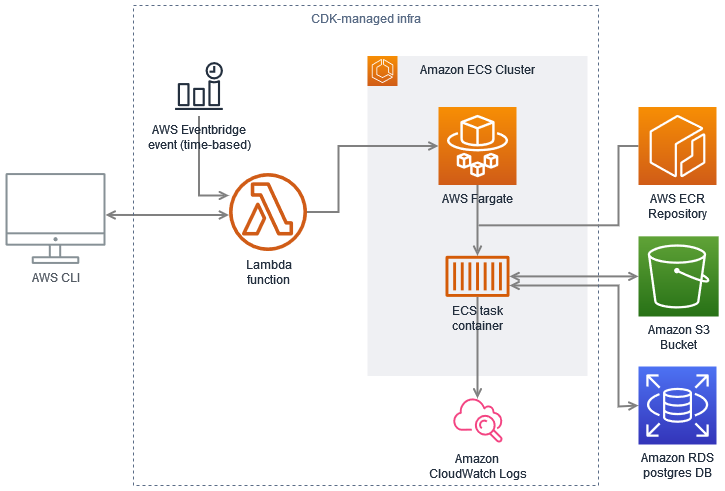

# AGR DB Backups

This repo holds the code used to run automated (daily) postgres DB dumps through AWS Lambda,
and to restore them, enabling data rollback to different environments.

## Contents

-  [Developing](#developing)
-  [Deployment](#deployment)
-  [Invocation](#invocation)
   *  [Scheduled invocation](#scheduled-invocation)
   *  [Manual invocation](#manual-invocation)
   *  [Local invocation](#local-invocation)

## Application cloud architecture


This application is developed as a docker container (to include all external executables required)
and is intended to run locally (for local restores), or on AWS (for AGR database backup, restore and data migrations).
The AWS deployment uses an AWS lambda function as trigger mechanism.
   * For on-demand calls this function is called directly through the AWS CLI.
   * AWS EventBridge is used to trigger the function for scheduled backups (on a daily basis)

The lambda function initiates a (stand-alone) ECS task, which runs the latest application container image
from the `agr_db_backups_ecs` ECR repository. The ECS task leverages AWS fargate to automatically provision
the AWS execution (compute) infrastructure it requires, taking away the need to maintain any EC2 instances
for this ourselves and reducing the cost to run this application by scaling automatically.
All logs of these application executions get stored in AWS CloudWatch Logs.

This architecture was based on an AWS Prescriptive Guidance pattern described [here](https://docs.aws.amazon.com/prescriptive-guidance/latest/patterns/run-event-driven-and-scheduled-workloads-at-scale-with-aws-fargate.html).

## Developing
This application is developed as a docker container, to include all external executables required.

To test the main application locally while actively changing code:
```bash
#Build the container (essential when dependencies changed, optional when only application code changes were made.)
> docker build -t agr_db_backups_ecs .
# Execute any command using the latest code by mounting it into the prebuilt container
# Below example command breakdown:
#  * "--net container:postgres":
#      Run the container in the same network as your local dockerized database (here a container called "postgres").
#      This is required to enable using your local database as target for backup or restore.
#  * "-v /.../app:/app":
#      To enable quick testing of local changes, without requiring rebuilding the container for every change made,
#      you can mount-in the app directory. That way every container run uses the current local code.
# * "-v ~/.aws:/root/.aws -e AWS_PROFILE":
#      As the application will (optionally) try to retrieve configuration settings from AWS SSM,
#      and (always) upload/download the backup file to/from S3, the container needs to be aware of valid AWS credentials
#      to authorize access. This can either be done by defining, exporting and passing on the AWS access key,
#      secret key and default region directly through the applicable environment variables (see https://docs.aws.amazon.com/cli/latest/userguide/cli-configure-envvars.html),
#      or by passing your local AWS configuration files into the backup container, optionally accompanied by the
#      AWS_PROFILE variable to indicate the named profile to use, if your agr profile does not have the "default" name.
#
# Application options:
#  "identifier" and "target_env" are required data fields, all others will be retrieved from SSM when left undefined,
#  or use the defined value otherwise (note that SSM does not hold values for local dev env operations/testing).
> docker run --rm -it --net container:postgres -v /home/mlp/gitrepos/agr-db_backups/app:/app -v ~/.aws:/root/.aws -e AWS_PROFILE agr_db_backups_ecs --help
```


## Deployment
The application is built as a container image and uploaded to ECR.
The AWS resources and infrastructure required to make the application
callable and executable in AWS are defined and deployed using AWS CDK.

AWS CDK is an open-source framework that enables writing
the entire cloud application as code, including all event sources and other AWS resources
which are require to make the application executable in AWS in addition to the application code.
This allows for an easy and reproducible deployment, that can be fully documented and versioned as code.

All CDK files in this repository are written in python and stored in the [aws_infra](./aws_infra/) directory.
For more details on the AWS CDK, how to use it, and how to deploy this application to AWS,
see the [aws_infra README](./aws_infra/README.md).

Any code pushed to the main branch of this repository (both main application and CDK code)
automatically gets built and deployed, through [github actions](./.github/workflows/main-build-and-deploy.yml).


## Invocation
### Scheduled invocation
To enable automatic scheduled backups of several application DBs and environments,
Amazon EventBridge is used to trigger the deployed AWS lambda trigger of this repository.

A single event was created (as `nightly-backup-schedule`, as part of the `LambdaEcsTrigger` CDK construct
in [ecs_stack.py](./aws_infra/cdk_classes/ecs_stack.py)), which fires a nightly execution for
each of the backup targets defined in the [backup_list.json](./aws_infra/resources/backup_list.json).
Each entry in this list represents the payload sent to the lambda trigger for one environment of one application
requiring scheduled backup.

To add the backup of a new DB or environment to the backup list:
1. Ensure the necessary parameters for the DB to be backed up are stored in the [AWS Systems Manager Parameter Store](https://us-east-1.console.aws.amazon.com/systems-manager/parameters/). This repository code retrieves the required (unprovided) credentials from the parameter store.
2. Add a new record to the [backup_list.json](./aws_infra/resources/backup_list.json) file.
3. Commit the above made changes and create a PR to merge into the main branch.
   After PR merge, the new event will get deployed automatically and the new backups will run on the nightly backup schedule.

### Manual invocation
As the main application is triggered through an AWS lambda function, it can be manually invoked through the aws cli.
This can be useful to invoke a one-off backup of a specific database/environment before attempting to make manual changes to it,
or to restore a dump of one environment, to any other environment (and resetting the data in place in the process).

Requesting the help documentation results in a synchronous return of that documentation (as a json payload).
Any other payload will result in an asynchronous execution through AWS ECS,
and should return a json payload in the below format.

Two elements in this output can be used to follow up on the request execution:
 * `task_details_url`: the AWS Console URL to view and follow-up on the state of the initiated ECS task
 * `task_logs_url`: the AWS Console URL to view the logs of the initiated ECS task

```json
{
  "initiated_task_arn": "arn:aws:ecs:us-east-1:...:task/DbBackupsCdkStack-.../...",
  "task_logs_url": "https://us-east-1.console.aws.amazon.com/cloudwatch/home?region=us-east-1#logsV2:log-groups/log-group/DbBackupsCdkStack-.../log-events/DbBackupsCdkStackDbBackups...",
  "task_details_url": "https://us-east-1.console.aws.amazon.com/ecs/home?region=us-east-1#/clusters/DbBackupsCdkStack-.../tasks/.../details"
}
```

To print (readably-formatted) help on all available arguments for the payload:
```bash
aws lambda invoke --function-name agr_db_backups --cli-binary-format raw-in-base64-out  --payload '{"help": "true"}' lambda.output \
 && jq . lambda.output
```

To request an one-off backup of the curation alpha DB:
```bash
# Change the payload to match the desired application (identifier) and target environment if not curation-alpha.
aws lambda invoke --function-name agr_db_backups --cli-binary-format raw-in-base64-out \
 --payload '{"action": "backup", "target_env": "alpha", "identifier": "curation", "region": "us-east-1", "s3_bucket": "agr-db-backups"}' \
 lambda.output && jq . lambda.output
```

To restore the latest production DB backup to the beta environment:
```bash
# Change the payload to match the desired application (identifier), source environment and target environment if not curation prod => beta.
aws lambda invoke --function-name agr_db_backups --cli-binary-format raw-in-base64-out \
 --payload '{"action": "restore", "target_env": "beta", "src_env": "production", "identifier": "curation", "region": "us-east-1", "s3_bucket": "agr-db-backups"}' \
 lambda.output && jq . lambda.output
```

Such manual invocations should produce output like the following on STDOUT:
```bash
{
    "StatusCode": 200,
    "ExecutedVersion": "$LATEST"
}
```
in addition to the standard output as described above. Should the invokation report a
non-200 `StatusCode` or `"FunctionError": "Unhandled"` in its reported status, then the lambda trigger failed
(not the backup or restore that was supposed to be launched). Try the same invocation again.

The output of the function, with the logs and ECS task details URLs can be found in the `lambda.output` file.

As another option for local backup and restore, the docker image can be invoked directly
and the application execution configured through CLI options.
```bash
docker build -t agr_db_backups_ecs .
docker run --rm -it -v ~/.aws:/root/.aws -e AWS_PROFILE=agr agr_db_backups_ecs --help
```
### Local invocation
In addition to triggering execution on AWS as describe above,
you can execute the application container locally to restore to (or backup from) your local postgres database.
For more information on the docker arguments used, see the [developing](#developing) section. 
```bash
#To restore the latest available curation alpha dump to your local postgres DB:
> docker run --rm -it --net container:postgres -v ~/.aws:/root/.aws -e AWS_PROFILE 100225593120.dkr.ecr.us-east-1.amazonaws.com/agr_db_backups_ecs:latest --action restore --identifier curation --src_env alpha --target_env mluypaert-dev --db_name curation --db_user $PGUSER --db_password $PGPASSWORD --db_host postgres --ignore_privileges true
#To backup your local postgres DB (note: this will upload dumpfile of your local DB to S3):
> docker run --rm -it --net container:postgres -v ~/.aws:/root/.aws -e AWS_PROFILE 100225593120.dkr.ecr.us-east-1.amazonaws.com/agr_db_backups_ecs:latest --action backup --identifier curation --target_env mluypaert-dev --db_name curation --db_user $PGUSER --db_password $PGPASSWORD --db_host postgres --s3_bucket agr-db-backups
```
